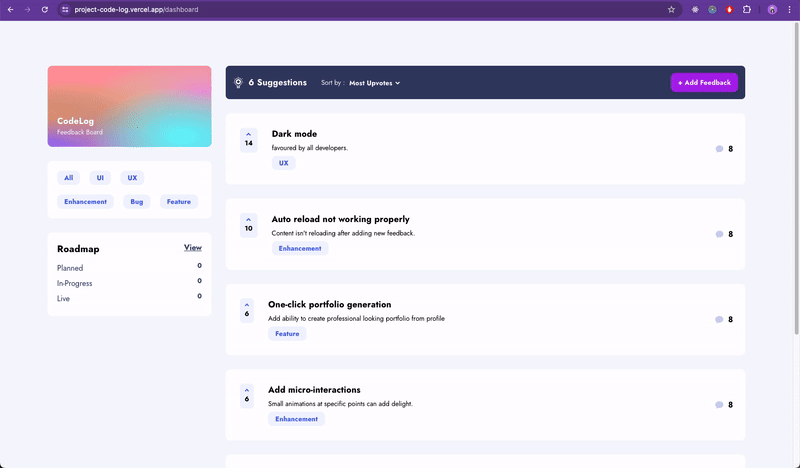
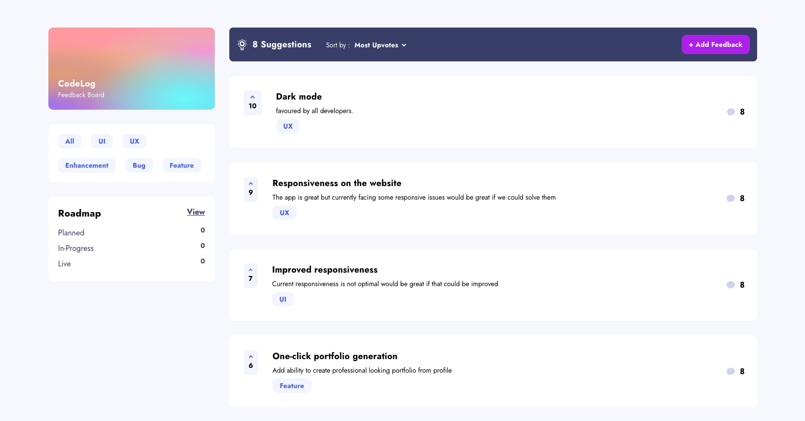

# Code Log

Wouldn't it be cool if there was a single place where the development team could come together and track the growth of their project ?

This is what you get with CodeLog where the developers can log their insight for project growth and share their learnings to improve the project.

---

## Table of Contents

1. [Overview](#overview)
2. [Tech Stack](#tech-stack)
3. [Features](#features)
4. [Installation](#installation)
5. [Usage](#usage)
6. [Screenshots](#screenshots)
7. [Contributing](#contributing)
8. [License](#license)
9. [Contact](#contact)

---

## Overview

CodeLog is a user-centric app designed to streamline product feedback management, enabling teams to create, read, update, and delete feedback requests effortlessly. The app allows suggestions to be sorted by the most or least upvotes and filtered by category, making it easy to prioritize and focus on relevant feedback. Its responsive design adapts seamlessly to any device, delivering an optimal layout for smartphones, tablets, and desktops. Additionally, interactive elements with hover states enhance usability, providing a dynamic and intuitive experience for managing feedback effectively and driving meaningful product improvements.

---

## Tech Stack

- **Front-end**: TypeScript, Angular, NgRx, Vanilla CSS, Vercel
- **Back-end**: TypeScript, Node.js, Express.js, Prisma
- **Database**: PostgreSQL
- **Hosting**: Vercel, CI/CD, Render

---

## Features

- View all personal finance data at-a-glance on the Overview page.
  Perform full CRUD operations (Create, Read, Update, Delete) for budgets and saving pots.
- View the latest three transactions for each budget category.
- Track progress towards saving goals for each pot.
- Add and withdraw money from saving pots effortlessly.
- Enjoy an optimal layout for the interface on any device,

---

## Installation

Provide step-by-step instructions on how to set up the project locally.

Example:

1. Clone the repository:
   ```bash
   git clone https://github.com/username/project-name.git
   ```
2. Navigate to the project directory:
   ```bash
   cd project-name
   ```
3. Install dependencies:
   ```bash
   npm install
   ```
4. Start the development server:
   ```bash
   npm start
   ```

---

## Usage

Describe how to use the project. Include examples, code snippets, or commands to demonstrate functionality.

Example:
"To log in, use the default credentials provided in the seed data, or register for a new account."

---

## Screenshots



---

## Contributing

1. Fork the repository.
2. Create a new branch:
   ```bash
   git checkout -b feature-name
   ```
3. Commit your changes:
   ```bash
   git commit -m 'Add feature'
   ```
4. Push to the branch:
   ```bash
   git push origin feature-name
   ```
5. Create a pull request.

---

## License

This project is licensed under the MIT License.

---

## Contact

For any inquiries, please reach out at:

- **LinkedIn**: [in/arunpariyar](https://linkedin.com/in/arunpariyar)
- **GitHub**: [arunpariyar](https://github.com/arunpariyar)
